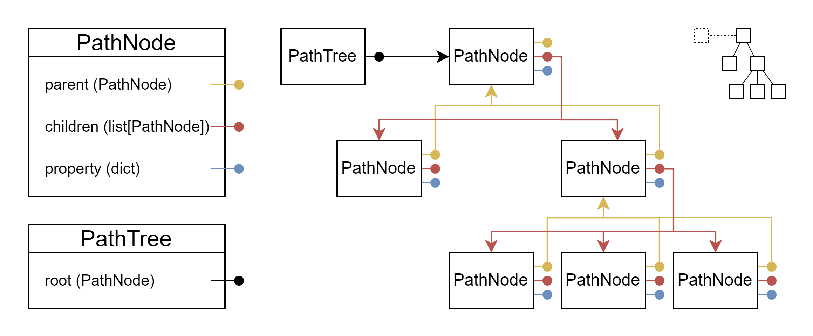

============================================
pathtreelib - Tree-based pathlib enhancement
============================================

This module main purpose is to provide a tree structure representation of file
system directories and files. The main objects are PathTree, which describe a
tree of directory, and PathNode, which describe a single node of the tree.

The building block is the Path object from the pathlib module. The Path is then
wrapped in a PathNode object, which stores explicitly information like
parent-children relationships and add functionalities like property computation
and storage. The PathNode objects are connected one another through links stored
on each node: this means that the structure is not a centralysed but is
distributed on the nodes. The PathTree provides an interface to query a tree
made up by the PathNode structure: such structure is fully generated
automatically at the tree creation starting from the passed root.

.. include:: intro.rst

.. toctree::
   :maxdepth: 2
   :caption: Contents:

   Getting started <intro>
   Runnable modules <runnable>
   PathNode
   PathTree
   PathTreeAnalytics
   PathTreeProperty
